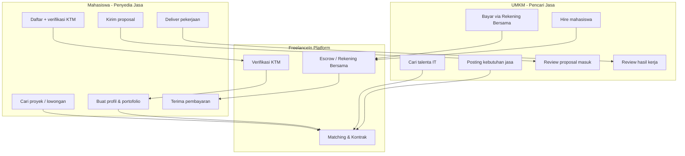
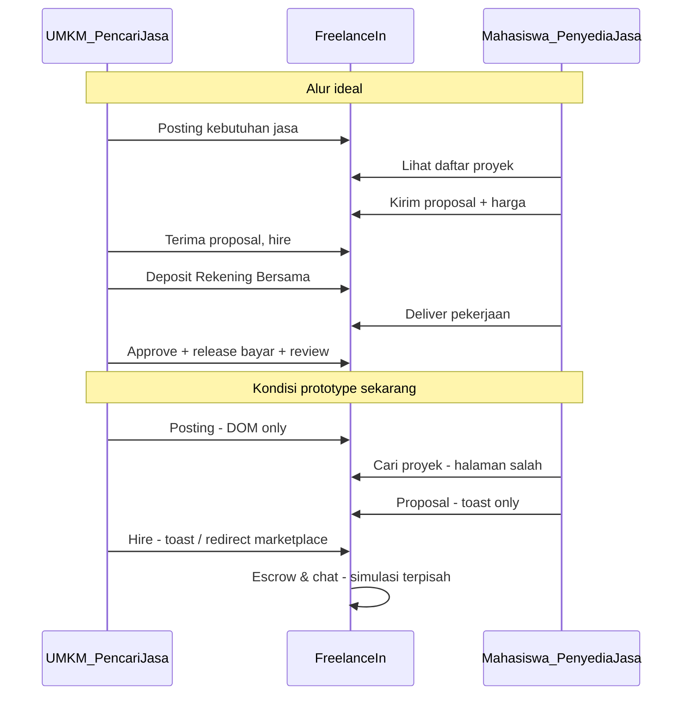

# Analisis: Apa yang Kurang dari Website FreelanceIn

## Model Pengguna (2 Peran)

FreelanceIn adalah **marketplace dua sisi** yang menghubungkan:

| Peran | Peran di platform | Kebutuhan utama |
|-------|-------------------|-----------------|
| **UMKM** | Klien / pencari jasa | Posting kebutuhan digital, cari mahasiswa IT, hire, bayar aman, review hasil |
| **Mahasiswa** | Freelancer / penyedia jasa | Tampilkan profil & portofolio, cari proyek, ajukan proposal, kerjakan & terima bayaran |

**Catatan:** Tidak ada peran admin di model pengguna saat ini, meskipun verifikasi KTM secara operasional membutuhkan moderator internal.

---

## Ringkasan Kondisi Saat Ini

FreelanceIn **bukan aplikasi web penuh** — ini adalah **prototype desain tinggi** (high-fidelity mockup) dengan 11 halaman HTML statis, design system FIDS, dan simulasi interaksi via `localStorage` + toast.

**Stack saat ini:** vanilla HTML/CSS/JS, dev server via `browser-sync` ([package.json](F:/Kampus/FreelanceIn/package.json)). Tidak ada framework, database, atau README.

**Ketidakseimbangan prototype:** UI lebih lengkap untuk sisi **UMKM mencari talenta** (`marketplace.html`) dibanding sisi **Mahasiswa mencari proyek** — padahal keduanya setara pentingnya di marketplace dua sisi.

---

## Yang Sudah Baik (Tidak Perlu Dibangun Ulang)

- Landing page marketing lengkap ([index.html](F:/Kampus/FreelanceIn/index.html))
- Design system FIDS v1.0 ([design-system.html](F:/Kampus/FreelanceIn/design-system.html))
- Marketplace talenta dengan filter client-side ([marketplace.html](F:/Kampus/FreelanceIn/marketplace.html)) — 4 profil hardcoded
- Auth dua peran: **Mahasiswa** dan **UMKM** ([login.html](F:/Kampus/FreelanceIn/login.html), [register-mahasiswa.html](F:/Kampus/FreelanceIn/register-mahasiswa.html), [register-umkm.html](F:/Kampus/FreelanceIn/register-umkm.html))
- Dashboard mahasiswa & UMKM dengan modal, metrik, daftar proyek ([student-dashboard.html](F:/Kampus/FreelanceIn/student-dashboard.html), [umkm-dashboard.html](F:/Kampus/FreelanceIn/umkm-dashboard.html))
- UI chat, tracking proyek/escrow 5 langkah, profil publik dengan portofolio & review

---

## Gap per Peran Pengguna

### Sisi UMKM (Pencari Jasa) — Sudah vs Kurang

| Kebutuhan UMKM | Status | Keterangan |
|----------------|--------|------------|
| Registrasi akun bisnis | Ada (mock) | [register-umkm.html](F:/Kampus/FreelanceIn/register-umkm.html) — data `localStorage` |
| Dashboard UMKM | Ada (UI) | [umkm-dashboard.html](F:/Kampus/FreelanceIn/umkm-dashboard.html) — metrik & daftar proyek statis |
| **Posting kebutuhan jasa** | **Partial** | Modal ada, tapi tidak persisten; tombol di landing = toast saja ([index.html](F:/Kampus/FreelanceIn/index.html) ~47) |
| **Cari talenta IT** | **Ada (UI)** | [marketplace.html](F:/Kampus/FreelanceIn/marketplace.html) — filter jalan, 4 profil hardcoded |
| Review proposal masuk | **Missing** | "Pilih Pelamar" redirect ke marketplace, bukan halaman review proposal |
| Hire mahasiswa | **Partial** | Modal "Pekerjakan" di profil = toast |
| Bayar via Rekening Bersama | **Simulasi** | [project-tracking.html](F:/Kampus/FreelanceIn/project-tracking.html) — tombol demo |
| Chat dengan mahasiswa | **Simulasi** | [messages.html](F:/Kampus/FreelanceIn/messages.html) — mock auto-reply |
| Review hasil kerja | **Partial** | Modal review = toast, tidak tersimpan |

### Sisi Mahasiswa (Penyedia Jasa) — Sudah vs Kurang

| Kebutuhan Mahasiswa | Status | Keterangan |
|---------------------|--------|------------|
| Registrasi + verifikasi identitas | **Partial** | [register-mahasiswa.html](F:/Kampus/FreelanceIn/register-mahasiswa.html) — checkbox KTM, **tanpa upload** |
| Dashboard mahasiswa | Ada (UI) | [student-dashboard.html](F:/Kampus/FreelanceIn/student-dashboard.html) |
| **Profil jasa & portofolio** | **Partial** | [profile.html](F:/Kampus/FreelanceIn/profile.html) — tampil bagus, data statis; edit tidak persisten |
| **Cari proyek / lowongan** | **Missing** | Nav "Cari Proyek" → halaman talenta yang sama ([index.html](F:/Kampus/FreelanceIn/index.html) ~29) |
| **Kirim proposal** | **Simulasi** | Tombol "Ajukan Proposal" → toast saja |
| Lacak status proposal | **Partial** | Daftar statis "Dalam Review" / "Negosiasi" di dashboard |
| Kerjakan proyek & upload deliverable | **Simulasi** | [project-tracking.html](F:/Kampus/FreelanceIn/project-tracking.html) |
| Terima pembayaran | **Simulasi** | Escrow release = tombol demo |
| Chat dengan UMKM | **Simulasi** | Sama seperti sisi UMKM |

### Titik Pertemuan Kedua Peran (Belum Jalan)

Alur inti marketplace — UMKM posting → Mahasiswa apply → UMKM hire → kerja → bayar — **belum terhubung end-to-end**:

---

## 1. Infrastruktur Teknis (Penting untuk Kedua Peran)

| Yang kurang | Bukti di codebase |
|-------------|-------------------|
| **Backend / API** | Tidak ada server, tidak ada `fetch()` ke API — semua data hardcoded atau `localStorage` |
| **Database** | User disimpan di key `freelancein_registered_users`; jobs, pesan, proposal tidak persisten |
| **Autentikasi nyata** | Login demo: `budi@mahasiswa.ui.ac.id` / `password123`; reset password = toast saja ([login.html](F:/Kampus/FreelanceIn/login.html) ~233) |
| **Deployment & CI** | Tidak ada config deploy, test, atau dokumentasi setup |
| **README / dokumentasi** | Tidak ada file README di repo |

Dashboard bahkan **auto-inject user mock** jika belum login ([student-dashboard.html](F:/Kampus/FreelanceIn/student-dashboard.html) ~422–434), sehingga prototype terasa "jalan" tanpa auth sungguhan.

---

## 2. Navigasi & Halaman yang Membingungkan Kedua Peran

Masalah navigasi saat ini **tidak membedakan kebutuhan UMKM vs Mahasiswa**:

| Link nav | Seharusnya untuk | Kondisi sekarang |
|----------|------------------|------------------|
| **Cari Talenta** | UMKM mencari mahasiswa | OK → [marketplace.html](F:/Kampus/FreelanceIn/marketplace.html) |
| **Cari Proyek** | Mahasiswa mencari pekerjaan | **Salah** — juga ke `marketplace.html` (daftar talenta, bukan lowongan) |
| **Posting Pekerjaan** | UMKM posting kebutuhan | **Stub** di landing (toast); form hanya di dashboard UMKM |
| Pencarian header | Keduanya | Hanya search talenta, tidak search proyek |

Komponen **Job Card** + "Kirim Proposal" hanya demo di [design-system.html](F:/Kampus/FreelanceIn/design-system.html), belum halaman live untuk mahasiswa.

---

## 3. Fitur Transaksi Bersama (Keduanya Butuh)

| Fitur | Status | Dampak ke UMKM | Dampak ke Mahasiswa |
|-------|--------|----------------|---------------------|
| Job posting persisten | Partial | Posting hilang saat refresh | Tidak ada proyek nyata untuk dilamar |
| Proposal submit + review | Missing | Tidak bisa pilih pelamar | Proposal tidak sampai ke UMKM |
| Kontrak & milestone | Simulasi UI | Tidak track progress nyata | Tidak bukti deliverable |
| Escrow / Rekening Bersama | Simulasi | UMKM belum yakin bayar aman | Mahasiswa belum yakin dapat bayar |
| Review & rating | Partial | Tidak evaluasi talenta | Reputasi tidak tumbuh |
| Notifikasi | Missing | Tidak tahu ada proposal baru | Tidak tahu proposal diterima/ditolak |
| Chat terhubung proyek | Simulasi | Komunikasi terputus dari kontrak | Sama |

---

## 4. Verifikasi & Kepercayaan (Penting untuk UMKM Percaya Mahasiswa)

Copy marketing menekankan **verifikasi KTM** sebagai diferensiator, tapi implementasinya belum ada:

- Registrasi mahasiswa: checkbox persetujuan verifikasi, **tanpa upload KTM** ([register-mahasiswa.html](F:/Kampus/FreelanceIn/register-mahasiswa.html) ~118–124)
- Dropzone upload KTM hanya ada di design system ([design-system.html](F:/Kampus/FreelanceIn/design-system.html) ~378), bukan di flow registrasi
- **Tidak ada panel admin** untuk review/approve KTM
- Badge "Terverifikasi KTM" di marketplace = data statis, bukan status dinamis

---

## 5. Komunikasi & Kolaborasi (Antara UMKM dan Mahasiswa)

- [messages.html](F:/Kampus/FreelanceIn/messages.html): UI chat bagus, tapi **mock auto-reply**, tidak ada WebSocket/polling, pesan tidak tersimpan antar sesi
- Upload file chat → toast "Mengunduh file..."
- Tidak ada integrasi chat dengan proyek/kontrak spesifik (thread terpisah dari tracking)

---

## 6. Halaman Konten & Legal (Footer Kosong)

Semua link footer masih `href="#"` ([index.html](F:/Kampus/FreelanceIn/index.html) ~586–620):

- Tentang Kami, Hubungi Support
- Syarat & Ketentuan, Kebijakan Privasi
- Rekening Bersama Aman, Verifikasi KTM, Tips Proposal, Komunitas
- Social media (Facebook, Twitter, Instagram, LinkedIn)

**Tidak ada halaman informasi** untuk menjelaskan escrow, proses verifikasi, atau FAQ — padahal ini penting untuk UMKM yang ragu membayar mahasiswa.

---

## 7. UX & Kualitas Produk

| Area | Gap |
|------|-----|
| **Role admin / moderator** | Tidak ada |
| **Settings / edit profil persisten** | UI ada, perubahan tidak tersimpan ke backend |
| **Pencarian global header** | Redirect ke marketplace dengan query param — tidak search jobs |
| **Pagination / infinite scroll** | Hanya 4 talenta hardcoded |
| **Multi-bahasa** | Hanya Bahasa Indonesia (OK untuk target market) |
| **Accessibility audit** | Belum diverifikasi (ARIA, keyboard nav, contrast) |
| **SEO beyond landing** | Meta description hanya di index; halaman lain minimal |
| **Error states / empty states** | Terbatas; banyak asumsi data selalu ada |
| **Mobile experience** | Ada mobile nav & filter drawer, tapi perlu uji menyeluruh |

---

## 8. Keamanan (Jika Dilanjut ke Production)

Saat ini belum relevan karena prototype, tapi **wajib** sebelum go-live:

- Password disimpan plain di `localStorage` (registrasi)
- Tidak ada CSRF, rate limiting, validasi server-side
- Tidak ada enkripsi data sensitif (KTM, dokumen kontrak)
- Session management tidak ada (hanya JSON di localStorage)

---

## Prioritas Rekomendasi per Peran

### Fase 1 — MVP: Kedua Sisi Bisa "Bertemu"

**Infrastruktur bersama**
1. Pilih stack backend (Next.js + Supabase, Laravel + MySQL, dll.)
2. Auth nyata dengan role `umkm` dan `mahasiswa`

**Sisi UMKM (pencari jasa)**
3. Posting kebutuhan jasa persisten (judul, deskripsi, budget, deadline, kategori)
4. Halaman review proposal masuk per posting
5. Tombol hire → buat kontrak proyek

**Sisi Mahasiswa (penyedia jasa)**
6. Halaman **Cari Proyek** terpisah (bukan marketplace talenta)
7. Profil jasa + portofolio persisten
8. Form kirim proposal (cover letter, harga, estimasi waktu)

**Pertemuan**
9. Notifikasi: UMKM dapat proposal baru, mahasiswa dapat update status

### Fase 2 — Trust & Transaksi
10. Upload & verifikasi KTM mahasiswa (+ panel admin internal)
11. Escrow / Rekening Bersama (Midtrans/Xendit atau manual)
12. Project tracking terhubung kontrak nyata
13. Chat persisten per proyek

### Fase 3 — Polish
14. Review/rating setelah proyek selesai
15. Halaman legal, FAQ escrow, About
16. SEO, analytics, deployment production

---

## Kesimpulan

FreelanceIn dirancang sebagai **marketplace dua sisi**: UMKM mencari jasa IT, mahasiswa menawarkan jasa. **UI sudah memvisualisasikan kedua peran** (dashboard terpisah, registrasi terpisah, profil mahasiswa), tapi **fungsionalitas belum seimbang**:

- **Sisi UMKM** lebih lengkap di UI (cari talenta, posting modal, dashboard) — tapi posting & hire masih simulasi
- **Sisi Mahasiswa** lebih lemah — tidak ada halaman cari proyek nyata, proposal & pembayaran masih toast/demo
- **Titik pertemuan** (posting → proposal → hire → bayar) belum ada sama sekali

Website ini cocok sebagai **prototype/demo**, belum siap dipakai UMKM dan mahasiswa sungguhan sampai alur dua sisi di atas diimplementasikan dengan backend.
